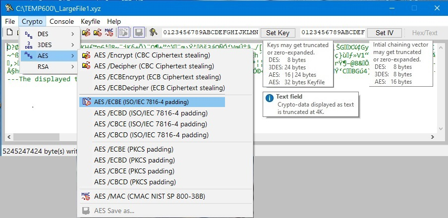

# haCrypt

Crypto utility for DES, AES, TDEA and RSA  
 


haCrypt is Freeware. It may be distributed freely by anyone who finds it useful.  
haCrypt can be used privately as well as for educational reference or development support.  

#### What is haCrypt

haCrypt is a compact, self-explaining ease-of-use crypto tool,  
supporting the standard Crypto algorithms: DES, AES, TDEA and RSA.  
RSA allows secure exchange of keys for the symmetric algorithms.   
Various symmetric modes like ECB, CBC with Ciphertext Stealing  
as well as ISO/IEC, PKCS#5 Padding and CMAC are available.  
Fast encryption and decipher of small and large files.  
*Features:*  
  Multifile processing, Multifile extensions rename   
  AES encrypted vault function for edited text  
  Test functions for development and reference verification  
  AsciiHex-to-Binary conversion of textual test vectors  
  HEX/TEXT display   
  Optional CONSOLE application HEDIT.EXE (for crypto batch processing)  
  RSA key-pair generator, RSA encryption/decipher, Random key generator  

#### Features in detail:
- Compact *self-explaining* user interface  
- Fix window size  
- Asymmetric Crypto Algorithm: RSA  
   `#rsaPublicKey[haCrypt].bin` (ha Public-Key)  
--   *Modes:*  
--    RSA /Generate Keys    
--    RSA /Import public key  
--    RSA /Load private key    
--    RSA /Encrypt    
--    RSA /Decipher    
--    RSA /Generate random key128    
--    RSA /Generate random key256    
- Symmetric Crypto Algorithms: DES, AES, TDEA  
   All according key sizes are supported  
--   *Modes:*  
--    ECB Ciphertext Stealing  
--    CBC Ciphertext Stealing  
--    ISO/IEC 7816-4 Padding  
--    PKCS#5 Padding  
--    CMAC NIST SP800-38B  
- Fast crypto processing
- Crypto Support for large files greater 4 Gbyte
- Progressbar and counter for files greater 8 Mbyte
- Multifile processing
- Multifile rename of file extensions [screenshot](document/image/haCrypt_03.jpg)   
- AES encrypt edited text: Create a vault-file to store keys, etc. [screenshot](document/image/haCrypt_06.jpg)  
- Test Functions for development and reference verification
- AsciiHex-to-Binary Conversion of textual test vectors [screenshot](document/image/haCrypt_07.jpg)   
- Hide / Show Key
- Key / IV input:  
--   via Keyboard dialog  
--   from File  
--   via AsciiHex-to-Binary (via test functions)  
- Text-field with limited edit capability
- Separate file saving button for displayed text
- Separate file saving button for binary crypto data
- Quick access tool buttons for default crypto modes  
--   /DES  (ECB ciphertext stealing)  
--   /AES  (CBC ciphertext stealing)  
--   /3DES (CBC ciphertext stealing)  
--   /Encrypt  
--   /Decipher  
--   /MAC  
--   Apply last selection from crypto menu  
--   Save encrypted/deciphered data  
- Quick access tool buttons for text mode    
--   /TEXT (edit a new text)    
--   Open a text file    
--   Save displayed text    
- HEX/TEXT display toggle switch [screenshot](document/image/haCrypt_01.jpg)  
- Font expected for Hex data display: "Consolas"  
- ESC-ABORT [screenshot](document/image/haCrypt_05.jpg)  
- Fancy colored toobar mode
- Help information
- Optional CONSOLE application DOS HEDIT.EXE [screenshot](document/image/haCrypt_04.jpg)   

#### Build haCrypt (32bit) Version 1.4.1
 
haCrypt project sources `*.cpp` are written in explicit 'C',  
observing the syntax of the MS C++ Compiler.  

To [build](document/build/VS2010build32.jpg) the haCrypt executable as 32bit-Version for Windows XP, Vista, Windows 10, 11, ..   
source files (including subfolders `*.BMP *.ICO`) reside in the folder `c:\temp600\__\*.*`,   
and are compiled within the *Visual Studio 2010 Developer Command Prompt*:  

```bld32bit
Setting environment for using Microsoft Visual Studio 2010 x86 tools.      
C:\Program Files (x86)\Microsoft Visual Studio 10.0\VC>NMAKE c:\temp600\__\haCrypt.NMK /all 
```
32bit System requirements: Windows XP, Vista, Windows 10, ... or greater  
Tools:  
- Microsoft<sup>(R)</sup> VS 2010 Developer Command Prompt x86 tools  
- Microsoft<sup>(R)</sup> Macro Assembler Version 14.28.29910.0 (from VS 2019)  
- Microsoft<sup>(R)</sup> C/C++ Compiler Version 16.00.30319.01 for 80x86 XP  
- Microsoft<sup>(R)</sup> Incremental Linker Version 10.00.30319.01  
- Microsoft<sup>(R)</sup> Program Maintenance Utility, Version 10.00.30319.01  

... see the Nmake-script `source/haCrypt.NMK` for details.

Note: When compiled with *MS Visual Studio 2019*, the executables will no longer run under Windows XP.  
      To build and run the haCrypt project under another OS, some adaptations are required.

#### Build haCrypt (64bit) Version 1.4.1
 
A 64bit-Version of haCrypt is automatically [built](document/build/VS2019build64.jpg) when invoked under:

```bld64bit
**********************************************************************    
** Visual Studio 2019 Developer Command Prompt v16.8.4    
** Copyright (c) 2020 Microsoft Corporation    
**********************************************************************    
[vcvarsall.bat] Environment initialized for: 'x64'  
C:\Program Files (x86)\Microsoft Visual Studio\2019\Community>NMAKE c:\temp600\__\haCrypt.NMK /all
```
64bit System requirements: Windows 10, 11, .. 64bit  
Tools:
- Microsoft<sup>(R)</sup> VS 2019 Developer Command Prompt v16.8.4 for 'x64'  
- Microsoft<sup>(R)</sup> Macro Assembler (x64) 'ML64' Version 14.28.29336.0  
- Microsoft<sup>(R)</sup> C/C++ Optimizing Compiler Version 19.28.29336 for x64  
- Microsoft<sup>(R)</sup> Incremental Linker Version 14.28.29336.0  
- Microsoft<sup>(R)</sup> Program Maintenance Utility, Version 14.28.29336.0  

... see the Nmake-script `source/haCrypt.NMK` for details.

#### haCrypt-Test: `_TEST_SUITE\__Public_Reference_Test`

Textual vectors for crypto development with verified results

```tst
\_Reference_Fox  
_!_ALL_3des_fox.txt  
_!_ALL_aes_fox.txt  
_!_ALL_des_fox.txt  
_FOX_RAW.TXT  
_FOX_PAD.TXT  

\_Reference_Mac  
\_!_ALL_3des_MAC.txt  
\_!_ALL_aes_MAC.txt  
\_!_ALL_des_MAC.txt  

\_Reference_Vectors  
\_!_ALL_3destest.txt  
\_!_ALL_aestest.txt  
\_!_ALL_destest.txt

\_haCrypt_Examples    
\haCrypt TEST Example (AES).txt  
\haCrypt TEST Example (AES-MAC).txt  
\haCrypt TEST Example (DES).txt  
\haCrypt TEST Example (3DES).txt  
```

#### HEDIT.EXE - Optional console application  
Note: `HEDIT.EXE` must reside together with `haCrypt.exe` in the same directory  
- Hedit.exe. V1.5
- DES.exe..  V2.0
- AES.exe..  V2.0
- TDES.exe   V2.0  
see [HEDIT 1.5 Help.txt](HEDIT%201.5%20Help.txt)  

#### HEDIT Help
```
C:\>hedit /?
HEDIT filename | /MEMORY | [/MERGE filename] | [/HDD driveletter [SectorNr]]
  filename    Pathname of the input file to be edited.
  /MERGE      Merges any splitted 'filename.ODD/EVN' to 'filename.MRG'.
  /M[EMORY]   Examines 4Gbyte of (unprotected) system memory space.
  /HDD        Hard Drive sector editor. Usage e.g. [/HDD E: 0]
  /DES        Explains usage of the integrated DES Crypto Module.
  /TDES       Explains usage of the integrated TDES Crypto Module.
  /AES        Explains usage of the integrated AES Crypto Module.
```  

```
C:\>hedit /AES  
AES Crypto Utility, V1.00 (c)2021 by ha
Performs encryption and decryption using the Advanced Encryption Standard.

Usage: 'HEDIT srcfile destfile [keyfile | /keystring] [options] [ivfile] /AES'
  srcfile    Input file (plain text or encrypted text >= 16 bytes).
  destfile   Output file (after the algorithm has been applied).
  ivfile     Input iv-file (Init Vector, optional for CBC modes).

  keyfile    Input file containing the secret key.
             The key can be 32 bytes max (keysize = 128,192,256 bits).
             Short keys will be zero-expanded.
  /keystring To avoid a keyfile the key may be directly given as
             a string of up to 32 ascii characters: e.g. /1234567890...
[options]
  /ENCRYPT   Encrypts a file. The plaintext is AES encrypted.
             Mode: CBC with ciphertext stealing.

  /DECIPHER  Deciphers an encrypted file. The AES ciphertext is converted
             into plaintext. Mode: CBC with ciphertext stealing.

  /MAC       A Message Authentication Code (MAC) is calculated from srcfile.
             The cryptographic signature is written to destfile, that can be
             appended to the plaintext as a cryptographic signature.
             Mode: (CMAC NIST SP 800-38B).

  /ECBENCRYPT  Encrypts a file. The plaintext is AES encrypted.
               Mode: ECB with ciphertext stealing.

  /ECBDECIPHER Deciphers an encrypted file. The AES ciphertext is converted
               into plaintext. Mode: ECB with ciphertext stealing.

  /CBCE     Encrypts a file. Mode: CBC with ISO/IEC 7816-4 padding.

  /CBCD     Deciphers an encrypted file. Mode: CBC with ISO padding.

  /ECBE     Encrypts a file. Mode: ECB with ISO/IEC 7816-4 padding.

  /ECBD     Deciphers an encrypted file. Mode: ECB with ISO padding.

This utility is very fast! When encrypting files, always be careful
about keeping your keys privately at a secure place.
Never send an encrypted file and its secret key through the same channel.
For example, if you sent the encrypted file and this utility via e-mail
 to a certain person, you should communicate the secret key via
 telephone or surface mail, addressing the entitled person.

NOTE:   'copy hedit.exe aes.exe' to build a crypto utility for AES only.
```  

Example 1:  
Crypto command example for HEDIT console application   
`for %i in (*.txt) do hedit %i F:\tmp\%~ni.enc /1234 /encrypt /aes`  

Example 2:  
`copy HEDIT.EXE AES.EXE` to yield AES console application   
Crypto command example for AES console application   
`for %i in (*.txt) do aes %i F:\tmp\%~ni.enc /1234 /encrypt`  
NOTE:    Pathnames `%i` - may not contain spaces.  
         Filename extensions `%i.*` - 3 characters max. (DOS convention)  

##### HEDIT-Test: `_TEST_SUITE\_BAT`

Crypto batches with verified results  

```bat
_TestAll.bat
HEDIT.EXE    

\AES  
_!_ALL_aes_fox.txt  
_FOX_RAW.TXT  
_FOX_PAD.TXT  
_ATFOXecb.BAT  
_ATFOXcbc.BAT  
_ATFOX.#K  
_AT128.#K  
_AT192.#K  
_AT256.#K  
_ATFOX.#I  

\AESMAC    

\DES  
_!_ALL_des_fox.txt  
_FOX_RAW.TXT  
_FOX_PAD.TXT  
_DTFOXecb.BAT  
_DTFOXcbc.BAT  
_DTFOX.#K  
_DTFOX.#I  

\DESMAC    

\TDES  
_!_ALL_3des_fox.txt  
_FOX_RAW.TXT  
_FOX_PAD.TXT  
_TDTFOXecb.BAT  
_TDTFOXcbc.BAT  
_TDTFOX.#K  
_TDTFOX.#I  

\TDESMAC    
```

#### Acknowledgements

Some reference-links that helped to develop haCrypt  

``` lnk
.https://learn.microsoft.com/de-de/windows/win32/api     
.https://devblogs.microsoft.com/oldnewthing    
.https://devblogs.microsoft.com/oldnewthing/tag/code
.https://devblogs.microsoft.com/oldnewthing/tag/code/page/141

.https://github.com/yottaawesome/forger-win32-tutorial
.https://github.com/mity/old-new-win32api
.https://github.com/eddelbuettel/digest/blob/master/src/aes.c  
.https://github.com/jubaer-pantho/RSA-Implementation-Cpp/blob/master    
.https://stackoverflow.com
.https://www.codeguru.com/windows/cbt-message-box  
.https://forums.codeguru.com  
    
-https://www.tutorialspoint.com/cplusplus-program-to-implement-the-rsa-algorithm    
.http://csrc.nist.gov/encryption/aes/rijndael/Rijndael.pdf  
.http://csrc.nist.gov/publications/fips/fips197/fips-197.pdf  
.http://web.mit.edu/cfields/info/des/DEShowto.txt  
.https://www.codeproject.com  
.https://www.nanoant.com/programming  
.https://www.nanoant.com/programming/themed-menus-icons-a-complete-vista-xp-solution.html  
.https://www.c-plusplus.net/forum/category/19/mfc
.https://cplusplus.com/forum/windows  
.https://www.c-sharpcorner.com/article/creating-custom-window-in-win32

.http://winapi.freetechsecrets.com/win32/
.https://www-user.tu-chemnitz.de/~heha/hs/chm/petzold.chm  
```
